# BeanFit App

Keep your devices and local-AI recommendation snapshots in one account.
BeanFit App is the browser companion to
[BeanFit](https://github.com/stevekkall-beansgc/beanfit): pair a device, review
what it sent, and keep its recommended stack.

This version stores snapshots. Automatic catalog-update alerts are planned,
not delivered.

## Pairing makes the data boundary visible



Transmission happens before the browser approval. Approval links the pending record to the account; the diagram does not imply that denial instantly deletes every record.
[Full-size diagram](assets/readme-flow.svg) · [Editable source](assets/readme-flow.mmd).

## What it does (customer flow)

1. Create an account in the configured app.
2. Run `beanfit register` on the device to begin pairing.
3. Review the pending hardware profile and recommendation snapshot in the
   browser, then approve or deny it.
4. Open the linked device page to see the stored recommendation.

Hardware detection runs locally. Pairing transmits the sanitized hardware
profile and any supplied recommendation snapshot to this app, which stores
them as a pending record before you approve it. Approval links that pending
record to your account. Codes expire after 15 minutes and device credentials
are revocable. Fit estimates run locally and inherit BeanFit's limits; they
are not new benchmarks.

## Start as a developer

This repository is a Cloudflare Worker with server-rendered pages, a JSON API
and D1 storage. There is no client build framework. No public visitor demo
URL is supplied here.

Read [the local development guide](README-REFERENCE.md#development) before
creating a database or starting Wrangler. It covers schema preparation,
catalog loading and the pairing E2E. For a simple source-level test, after
installing the checked-in dependencies with `npm ci`:

```bash
npm test
```

The [pairing tests](test/) and [route implementation](src/routes/pair.js)
show the approval and credential handoff. The full supervised local E2E uses
a disposable database; it is not a production pairing test.

## Architecture ($0 by design)

[The architecture and flow](README-REFERENCE.md#architecture-0-by-design)
describe Workers, D1, sessions, explicit Google account linking and the fit
engine. Verify present platform limits and costs before deploying;
the heading is design intent, not a spending guarantee.

## Retention cleanup: first scheduled run observed

[RETENTION.md](RETENTION.md) records the source rules and the dated September
25 observation: one scheduled call with zero eligible candidates or deletions.
Do not infer repeated cleanup or a retention guarantee. Bean Sched remains
the sole recurring clock; this app has no cleanup cron.

## Deploying

Use [DEPLOY.md](DEPLOY.md) under separate deployment approval.
[The detailed reference](README-REFERENCE.md) retains the retention bounds,
security architecture and development commands. [AGENTS.md](AGENTS.md)
contains contributor and test rules.
